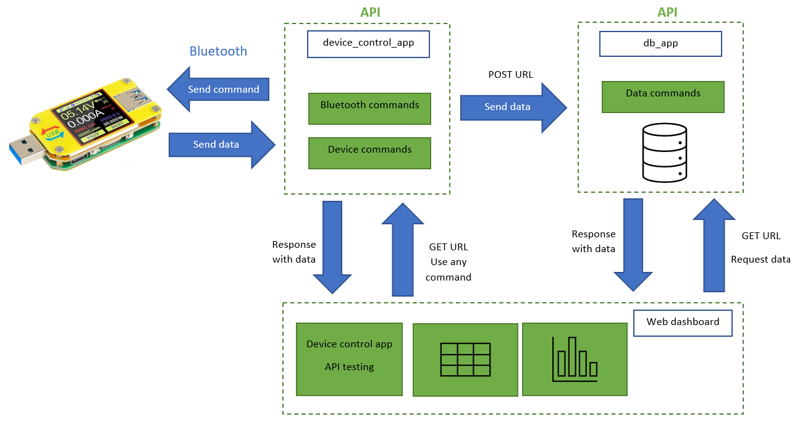
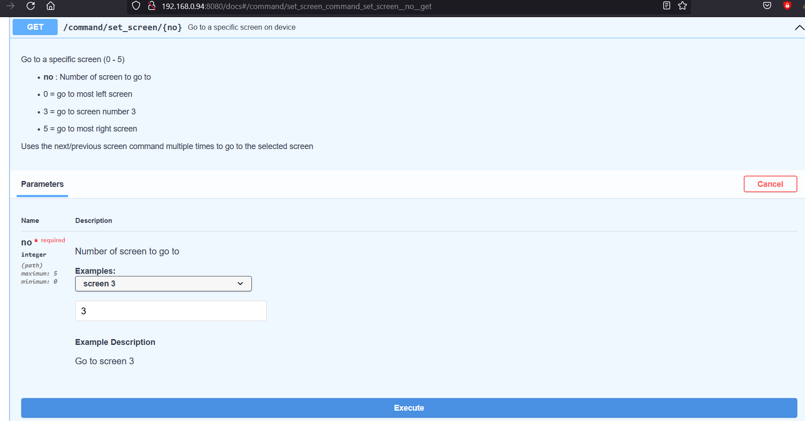

# UM34C with FastAPI

## What you can do with it

Control the UM34C device, store its data and show the data in a web dashboard.

It's also possible to only use the API for UM34C to just control it and get data out of it.

## How it works

device_control_app

db_app

Web dashboard with streamlit

# Used resources

https://sigrok.org/wiki/RDTech_UM_series

https://fastapi.tiangolo.com/

https://pybluez.readthedocs.io/en/latest/index.html

https://docs.streamlit.io
